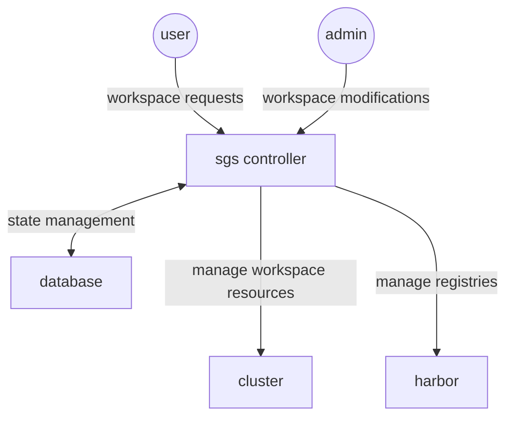

# sgs

## How it works

The SGS controller (this application) can be divided into two main components:

- Workspace management. It provides a web interface for users to request
  workspaces, and administrators to manage these requests.
- Resource management. For each active workspace, it manages external resources
  (such as Kubernetes Namespaces, Harbor registries, etc.) and ensures that all
  resources remain in sync.



The workspace management component is a straightforward CRUD application with
basic access control.

The resource management component maintains a queue, where "worker" invocations
are enqueued whenever a workspace is created, modified, or deleted, as well as
periodically to ensure that all resources are in sync. A worker invocation
executes the [`deploy/worker-sync.sh`](deploy/worker-sync.sh) script (controlled
with the `SGS_WORKER_COMMAND` environment variable) which does the following:

- Invoke `helm` to generate Kubernetes manifests for the each workspace.
  - It uses the [`deploy/chart`](deploy/chart) Helm chart to generate the
    manifests. This chart includes Namespaces, ResourceQuotas, LimitRanges, and
    RoleBindings.
- Invoke `kubectl` to apply the generated manifests to the cluster.
  - It uses the `--applyset` feature to prune resources that are no longer
    required, eg. due to deleted workspaces.
  - Due to a minor technical limitation, this requires the manifest to be
    non-empty at all times, even when there are no workspaces defined. We
    include the `ws-empty` Namespace to ensure this.
- Invoke `SGS_DEPLOY_REGHARBOR_PATH` (normally built from
  [`cmd/sgs-register-harbor`](cmd/sgs-register-harbor)) create the Harbor
  registry, add and remove users, and configure the ImagePullSecret in each
  workspace Namespace to allow
  pulling images from the registry.
  - **Note**: due to technical limitations, the ImagePullSecret registration is
    not idempotent. It can only run once per workspace, when it is first
    approved.

Each workspace can be in one of the following states:

- **Pending approval**: the workspace has been requested by a user, but has not
  been approved by an administrator. No resources are created for workspaces in
  this state.
- **Enabled**: the workspace has been approved by an administrator. External
  services (quotas, access control, etc.) will be kept in-sync.
- **Disabled**: the workspace has been disabled by an administrator. The
  Namespace will **not** be deleted, but it will not have a valid ResourceQuota
  or RoleBindings.
  - This ensure that workspaces can be re-enabled in the future, keeping any
    important data intact.

Whenever a non-pending resource has pending changes requested by a user, it will
be displayed as "Pending changes" in the workspace list.

## Development

### Prerequisites

- Go: most logic is written in Go.
- NodeJS (tailwind): for generating CSS for styling.
- Templ: server-side HTML rendering.
- PostgreSQL: database.

Use Nix to configure the development environment.

```console
$ # Open a shell with the development environment
$ nix develop

$ # Install npm dependencies
$ npm i

$ # Set up the development / test databases
$ docker-compose up -d
```

### Hot reloader

During development, you can use the hot reloader to automatically rebuild and
restart the server when you make changes to the code.

```console
$ make hotreload
```

### Tests

Run the tests with the following command:

```console
$ # ensure the test database is running
$ docker-compose up -d
$ make check
```

### Documentation

The user manual is written in markdown and rendered with mdbook. Run the
documentation server with the following command:

```console
$ # serve docs locally
$ make serve-docs
```
