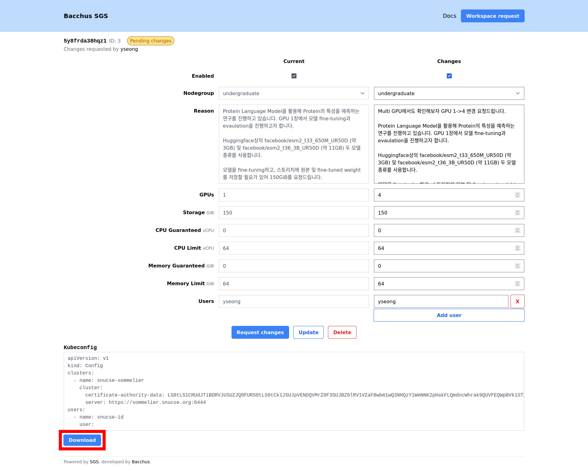

# Configure access

## Install CLI tools

In order to access our cluster, you need to download and install Kubernetes CLI
tooling ([`kubectl`][kubectl]) and the authentication plugin
([`kubelogin`][kubelogin]).

[kubectl]: https://kubernetes.io/docs/tasks/tools/
[kubelogin]: https://github.com/int128/kubelogin
[sgs]: https://sgs.snucse.org

### kubectl

TODO

### kubelogin (oidc-login)

TODO

## Download the kubeconfig file

Open the SGS [workspace management page][sgs] and navigate to your "Enabled"
workspace. Click the "Download" button at the bottom of the page to download the
kubeconfig file.



Place your downloaded kubeconfig file in the default kubeconfig location:

- **Unix** (Linux, MacOS): `~/.kube/config`
- **Windows**: TODO

## Verify your configuration

Use the `kubectl auth whoami` command to check everything is working correctly.
It should automatically open a browser window to log in to SNUCSE ID. After
logging in, you should see something similar to the following output:

```console
$ kubectl auth whoami
ATTRIBUTE   VALUE
Username    id:yseong
Groups      [id:undergraduate system:authenticated]
```
