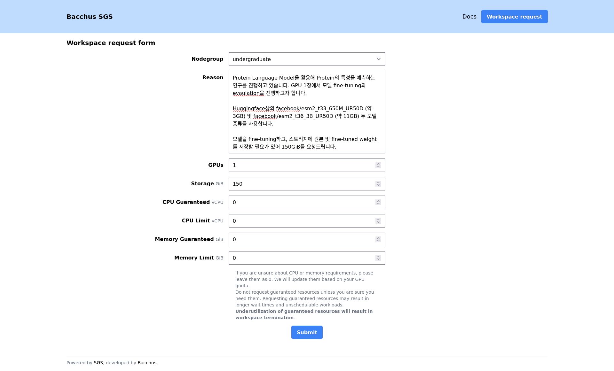
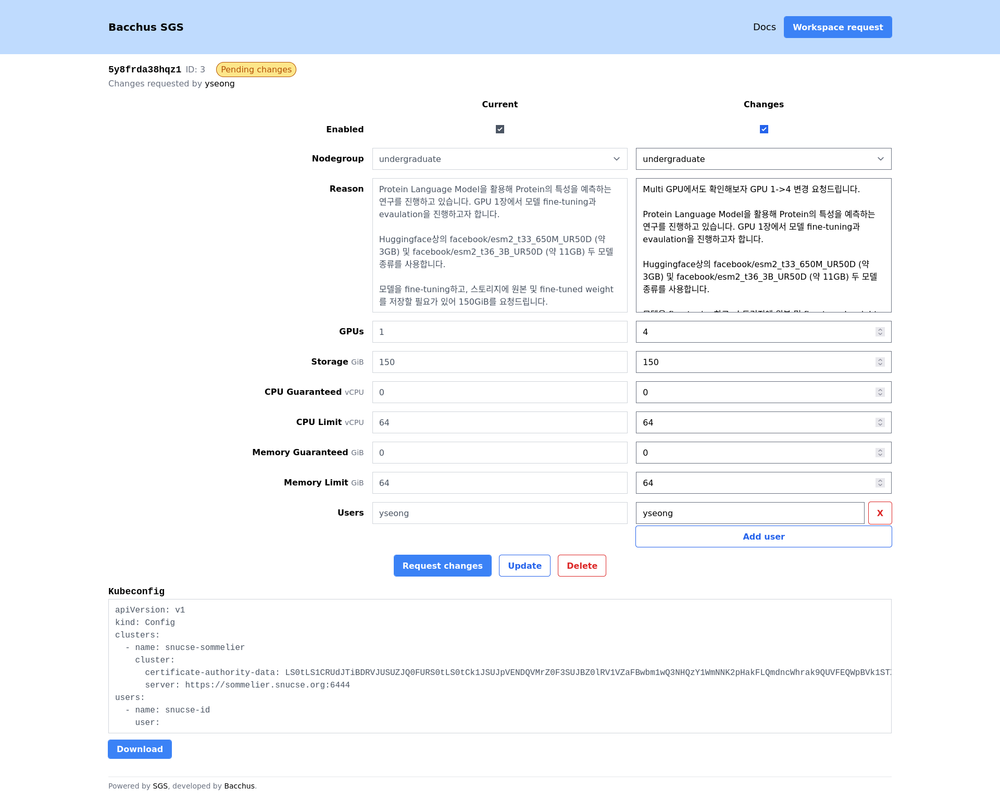

# Request a workspace

[id]: https://id.snucse.org
[sgs-request]: https://sgs.snucse.org/request

> Before continuing, you must already have a [SNUCSE ID][id] account registered
> in either the `undergraduate` or `graduate` groups.

To request a workspace, fill out the Workspace request form on the SGS
[workspace management page][sgs-request].

After submitting the form, your workspace will be in the "Pending approval"
state.

Your workspace request will be reviewed by Bacchus volunteers. Once approved,
your workspace will transition to the "Enabled" state.

You may request updates to your quota or the users list at any time. Use the
"reason" field to explain the purpose of the change. Similar to workspace
requests, change requests will be reviewed by Bacchus volunteers.

